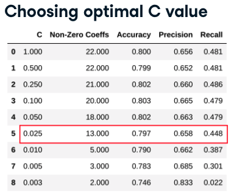

# Churn

Typically encoding with 1s and 0s

## Setup

```python
df.groupby(['Churn']).size() / df.shape[0] * 100

from sklearn.model_selection import train_test_split
train, test = train_test_split(df, test_size = .25)

target = ['Churn']
custid = ['customerID']
cols = [col for col in df.columns if col not in custid + target]

train_X = train[cols]
train_Y = train[target]
test_X = test[cols]
test_Y = test[target]
```

## Logistic Regression

* Classification for binary responses
* Models log-odds of the probability of the target
* Assumes linear relationship between log-odds target and predictors
* Returns coefficients and prediction probability

```python
from sklearn.linear_model import LogisticRegression
logreg = LogisticRegression()
logreg.fit(train_X, train_Y)
```

### Key metrics:

* Accuracy - % of correctly predicted labels (both churn and non-churn)
* Precision - % of total model's positive class predictions (predicted as churned and did actually churn)
* Recall - % of total positive class samples (number of total churn that was correctly classified as such)

```python
from sklearn.metrics import accuracy_score, precision_score, recall_score
pred_train_Y = logreg.predict(train_X)
pred_test_Y = logreg.predict(test_X)

train_accuracy = accuracy_score(train_Y, pred_train_Y)
test_accuracy = accuracy_score(test_Y, pred_test_Y)

train_precision = round(precision_score(train_Y, pred_train_Y), 4)
test_precision = round(precision_score(test_Y, pred_test_Y), 4)

train_precision = round(recall_score(train_Y, pred_train_Y), 4)
test_precision = round(recall_score(test_Y, pred_test_Y), 4)
```

### Regularization

* Introduces penalty coefficient in the model building phase
* Addresses over-fitting (when patterns are "memorized by the model")
* Makes model more generalizable
* `LogisticRegression` from `sklearn` performs L2 regularization by default
  * L1 or LASSO can be called explicitly

```python
from sklearn.linear_model import LogisticRegression
logreg = LogisticRegression(penalty='l1', C=0.1, solver='liblinear')
logreg.fit(train_X, train_Y)

# Tuning L1 regularization
C = [1, .5, .25, .1, .05, .025, .01, .005, .0025]
l1_metrics = np.zeros((len(C), 5))
l1_metrics[:,0] = C

for i in range(0, len(c)):
    logreg = LogisticRegression(penalty='l1', C=C[i], solver='liblinear')
    logreg.fit(train_X, train_Y)
    pred_test_Y = logreg.predict(test_X)
    l1_metrics[i,1] = np.count_nonzero(logreg.coef_)
    l1_metrics[i,2] = accuracy_score(test_Y, pred_test_Y)
    l1_metrics[i,3] = precision_score(test_Y, pred_test_Y)
    l1_metrics[i,4] = recall_score(test_Y, pred_test_Y)

col_names = ['C', 'Non-Zero Coeffs', 'Accuracy', 'Precision', 'Recall']
print(pd.DataFrame(l1_metrics, columns=col_names))

# In this case we chose optimal C as 0.025 as it maintains the closest
#   level of Accuracy, Precision, and Recall while eliminating as many
#   features as possible (shown in Non-Zero Coeffs) - see image.
```




## Decision Tree Classifier

Very prone to overfitting. 

```python
from sklearn.tree import DecisionTreeClassifier
from sklearn.metrics import accuracy_score, precision_score, recall_score

mytree = DecisionTreeClassifier()

treemodel = mytree.fit(train_X, train_Y)

pred_train_Y = mytree.predict(train_X)
pred_test_Y = mytree.predict(test_X)

train_accuracy = accuracy_score(train_Y, pred_train_Y)
test_accuracy = accuracy_score(test_Y, pred_test_Y)

train_precision = round(precision_score(train_Y, pred_train_Y), 4)
test_precision = round(precision_score(test_Y, pred_test_Y), 4)

train_recall = round(recall_score(train_Y, pred_train_Y), 4)
test_recall = round(recall_score(test_Y, pred_test_Y), 4)

print(round(train_accuracy, 4))
print(round(test_accuracy, 4))

depth_list = list(range(2,15))
depth_tuning = np.zeros((len(depth_list), 4))
depth_tuning[:,0] = depth_list
for index in range(len(depth_list)):
    mytree = DecisionTreeClassifier(max_depth=depth_list[index])
    mytree.fit(train_X, train_Y)
    pred_test_Y = mytree.predict(test_X)
    depth_tuning[index,1] = accuracy_score(test_Y, pred_test_Y)
    depth_tuning[index,2] = precision_score(test_Y, pred_test_Y)
    depth_tuning[index,3] = recall_score(test_Y, pred_test_Y)

col_names = ['Max_Depth', 'Accuracy', 'Precision', 'Recall']
print(pd.DataFrame(depth_tuning, columns=col_names))
```

## Identify and Interpret Churn Drivers

Plotting tree rules

```python
from sklearn import tree
import graphviz

exported = tree.export_graphviz(decision_tree=mytree,
                                out_file=None,
                                feature_names=train_X.columns,
                                precision=1,
                                class_names=['Not churn', 'Churn'],
                                filled=True)
graph = graphviz.Source(exported)
display(graph)
```

Log Reg

```python
coefficients = pd.concat([pd.DataFrame(train_X.columns),
                          pd.DataFrame(np.transpose(logreg.coef_))],
                          axis = 1)

coefficients.columns = ['Feature', 'Coefficient']
coefficients['Exp_Coefficient'] = np.exp(coefficients['Coefficient'])
coefficients = coefficients[coefficients['Coefficient'] != 0]
print(coefficients.sort_values(by=['Coefficient']))

# Coefficients less than 1 decrease the odds and greater than 1 increase
#   the odds. 
# Say we have
# | feature | coefficient | Exp_Coefficient |
# | ------- | ----------- | --------------- |
# | tenure  |    -0.908   |    0.403        |
# | charges |     0.902   |    2.463        |
#
# Then each additional year of tenure, decreases churn odds by 1-0.403
# or 60%.
```