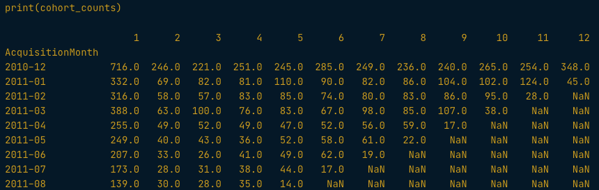

# Customer Lifetime Value

* Basic = Avg Revenue * Profit Margin * Avg Lifespan
* Granular Basic = (Avg Rev per purchase * Avg frequency * Profit margin) * Avg lifespan
* Traditional = (Avg Revenue * Profit Marging) * (Retention Rate/Churn Rate)
  * churn = 1 - retention rate
  * Not robust at low retention values (will under-report CLV)

## Cohort Retention

Using the cohort_counts df that looks like this:



```python
cohort_sizes = cohort_counts.iloc[:,0]
retention = cohort_counts.divide(cohort_sizes, axis = 0)
churn = 1 - retention

sns.heatmap(retention, annot=True, vmin=0, vmax=0.5, cmap="YlGn")
```

## Calculating and Projecting CLV

```python
### Basic Calculation ###
monthly_revenue = online.groupby(['CustomerID','InvoiceMonth'])['TotalSum'].sum().mean()

monthly_revenue = np.mean(monthly_revenue)
lifespan_months = 36 # user defined lifespan - can be inferred by avg time to churn

clv_basic = monthly_revenue * lifespan_months


### Granular Calculation ###
revenue_per_purchase = online.groupby(['InvoiceNo'])['TotalSum'].mean().mean()
freq = online.groupby(['CustomerID', 'InvoiceMonth'])['InvoiceNo'].nunique().mean()
lifespan = 36

clv_granular = revenue_per_purchase * freq * lifespan_months


### Traditional CLV Calculation ###
monthly_revenue = online.groupby(['CustomerID','InvoiceMonth'])['TotalSum'].sum().mean()

# exclude 1st column since it is 100%
retention_rate = retention.iloc[:,1:].mean().mean() 

churn_rate = 1 - retention_rate

clv_traditional = monthly_revenue * (retention_rate / churn_rate)
```

## Data Prep for Purchase Prediction

RFM Features - recency, frequency, monetary value

```python
online.groupby(['InvoiceMonth']).size()

# Exclude target variable
online_X = online[online['InvoiceMonth']!='2011-11']
NOW = dt.datetime(2011,11,1)
features = online_X.groupby('CustomerID').agg({
    'InvoiceDate': lambda x: (NOW - x.max()).days(),
    'InvoiceNo': pd.Series.nunique,
    'TotalSum': np.sum,
    'Quantity': ['mean', 'sum']
}).reset_index()
features.columns = ['CustomerID', 'recency', 'frequency', 'monetary', 
                    'quantity_avg', 'quantity_total']

cust_month_tx = pd.pivot_table(data=online,
                               index=['CustomerID'],
                               values='InvoiceNo',
                               columns=['InvoiceMonth'],
                               aggfunc=pd.Series.nunique,
                               fill_value=0)

custid = ['CustomerID']
target = ['2011-11']

Y = cust_month_tx[target]
cols = [col for col in features.columns if col not in custid]
X = features[cols]

from sklearn.model_selection import train_test_split
train_X, test_X, train_Y, test_Y = train_test_split(X, Y,
                                                    test_size=0.25)

```

## Predicting Customer Transactions

* Linear regression

Key Metrics: 

* Root mean squared error (RMSE) - sqrt of the avg squared diff between prediciton and actuals
* Mean absolute error (MAE) - Average absolute diff between prediction and actuals
* Mean absolute percentage error (MAPE) - avg percentage diff between prediction and actuals (actuals can't be zeros)

```python
from sklearn.linear_model import LinearRegression
linreg = LinearRegression()
linreg.fit(train_X, train_Y)

train_pred_Y = linreg.predict(train_X)
test_pred_Y = linreg.predict(test_X)


from sklearn.metrics import mean_absolute_error, mean_squared_error

rmse_train = np.sqrt(mean_squared_error(train_Y, train_pred_Y))
mae_train = mean_absolute_error(train_Y, train_pred_Y)

rmse_test = np.sqrt(mean_squared_error(test_Y, test_pred_Y))
mae_test = mean_absolute_error(testn_Y, test_pred_Y)


import statsmodels.api as sm

train_Y = np.array(train_Y)
olsreg = sm.OLS(train_Y, train_X)
olsreg = olsreg.fit()
print(olsreg.summary())
```