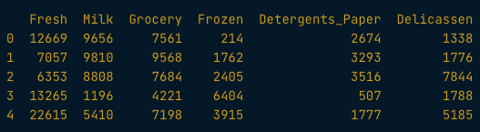

# Customer and Product Segmentation

## Data Format

* Customer by product/service matrix: 
  * Purchase data for each customer at product level
  * Matrix where columns are product names and rows have index of customer_id and sales against each product.




```python
wholesale.agg(['mean', 'std']).round(0)

averages = wholesale.mean()
st_dev = wholsesale.std()
x_names = wholesale.columns
x_ix = np.arange(wholesale.shape[1])

import matplotlib.pyplot as plt

plt.bar(x_ix-0.2, averages, color='grey', label='Average', width=0.4)
plt.bar(x_ix+0.2, st_dev, color='orange', label='Std Dev', width=0.4)
plt.xticks(x_ix, x_names, rotation=90)
plt.legend()
plt.show()

import seaborn as sns
sns.pairplot(wholesale, diag_kind='kde')
plt.show()
```

## Data Prep for Segmentation

### K-means

* Works well when data is:
  * normally distributed (no skew)
  * standardized (mean = 0, standard deviation = 1)

### NMF Model

* Can be used on raw data, especially if matrix is sparse

```python
# Unskew data with log-transform
wholesale_log = np.log(wholesale)
sns.pairplot(wholesale_log, diag_kind='kde')
plt.show()

# Unskew with Box-Cox transform
from scipy import stats
def boxcox_df(x):
    x_boxcox, _ = stats.boxcox(x)
    return x_boxcox

wholesale_boxcox = wholesale.apply(boxcox_df, axis=0)
sns.pairplot(wholesale_boxcox, diag_kind='kde')
plt.show()

# Scale Data
from sklearn.preprocessing import StandardScaler
scaler = StandardScaler()
scaler.fit(wholesale_boxcox)
wholesale_scaled = scaler.transform(wholesale_boxcox)
wholesale_scaled_df = pd.DataFrame(data=wholesale_scaled
                                   index=wholesale_boxcox.index,
                                   columns=wholesale_boxcox.columns)
wholesale_scaled_df.agg(['mean', 'std']).round()

### KMeans ###
from sklearn.cluster import KMeans
kmeans=KMeans(n_clusters=k)
kmeans.fit(wholesale_scaled_df)
wholesale_kmeans4 = wholesale.assign(segment = kmeans.labels_)

### NMF ###
from sklearn.decomposition import NMF
nmf = NMF(k)
nmf.fit(wholesale)
components = pd.DataFrame(nmf.components_, columns=wholesale.columns)

segment_weights = pd.DataFrame(nmf.transform(wholesale, 
                                             columns=components.index))
segment_weights.index = wholesale.index
wholesale_nmf = wholesale.assign(segment = segment_weights.idmxmax(axis=1))


### Defining number of segments (k) ###

# Elbow Method:
sse = {}
for k in range(1, 11):
    kmeans=KMeans(n_cluters=k)
    kmeans.fit(wholesale_scaled_df)
    sse[k] = kmeans.inertia_

plt.title('Elbow criterion method')
sns.pointplot(x=list(sse.keys()), y=list(sse.values()))
plt.show()

# If elbow is around 2 or 3, our K should be those + 1, so 3 or 4


# Test & Learn method:
#   * Build segments with elbow method
#   * Explore results and choose one with most business relevance
#       - Can you name segments based on their characteristics?
#       - Is there any ambiguity or overlap between them?
```


## Visualize and Interpret

```python
# Means for KMeans clusters
kmeans4_averages = wholesale_kmeans.groupby(['segment']).mean().round()
print(kmeans4_averages)

sns.heatmap(kmeans4_averages.T, cmap='YlGnBu')
plt.show()

# Means for NMF clusters
nmf4_averages = wholesale_nmf4.groupby('segment').mean().round(0)
sns.heatmap(nmf4_averages.T, cmap='YlGnBu')
plt.show()
```