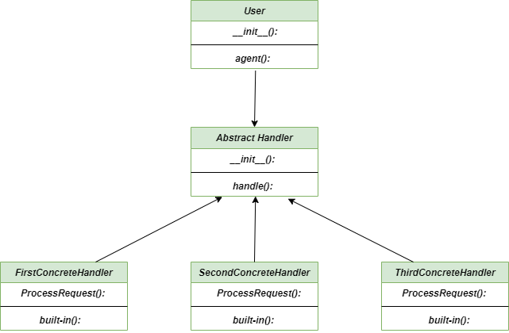

spend more time on this..

# Purpose

The oop version of if, elif, elif, else that allows users to rearrange
the order of conditionals at runtime.

## Use-Case 


```python
class AbstractHandler(object):
 
    """Parent class of all concrete handlers"""
 
    def __init__(self, nxt):
 
        """change or increase the local variable using nxt"""
 
        self._nxt = nxt
 
    def handle(self, request):
 
        """It calls the processRequest through given request"""
 
        handled = self.processRequest(request)
 
        """case when it is not handled"""
 
        if not handled:
            self._nxt.handle(request)
 
    def processRequest(self, request):
 
        """throws a NotImplementedError"""
 
        raise NotImplementedError('First implement it !')
 
 
class FirstConcreteHandler(AbstractHandler):
 
    """Concrete Handler # 1: Child class of AbstractHandler"""
 
    def processRequest(self, request):
 
        '''return True if request is handled '''
 
        if 'a' < request <= 'e':
            print("This is {} handling request '{}'".format(self.__class__.__name__, request))
            return True
 
 
class SecondConcreteHandler(AbstractHandler):
 
    """Concrete Handler # 2: Child class of AbstractHandler"""
 
    def processRequest(self, request):
 
        '''return True if the request is handled'''
 
        if 'e' < request <= 'l':
            print("This is {} handling request '{}'".format(self.__class__.__name__, request))
            return True
 
class ThirdConcreteHandler(AbstractHandler):
 
    """Concrete Handler # 3: Child class of AbstractHandler"""
 
    def processRequest(self, request):
 
        '''return True if the request is handled'''
 
        if 'l' < request <= 'z':
            print("This is {} handling request '{}'".format(self.__class__.__name__, request))
            return True
 
class DefaultHandler(AbstractHandler):
 
    """Default Handler: child class from AbstractHandler"""
 
    def processRequest(self, request):
 
        """Gives the message that th request is not handled and returns true"""
 
        print("This is {} telling you that request '{}' has no handler right now.".format(self.__class__.__name__,
                                                                                          request))
        return True
 
 
class User:
 
    """User Class"""
 
    def __init__(self):
 
        """Provides the sequence of handles for the users"""
 
        initial = None
 
        self.handler = FirstConcreteHandler(SecondConcreteHandler(ThirdConcreteHandler(DefaultHandler(initial))))
 
    def agent(self, user_request):
 
        """Iterates over each request and sends them to specific handles"""
 
        for request in user_request:
            self.handler.handle(request)
 
"""main method"""
 
if __name__ == "__main__":
 
    """Create a client object"""
    user = User()
 
    """Create requests to be processed"""
 
    string = "GeeksforGeeks"
    requests = list(string)
 
    """Send the requests one by one, to handlers as per the sequence of handlers defined in the Client class"""
    user.agent(requests)
```


